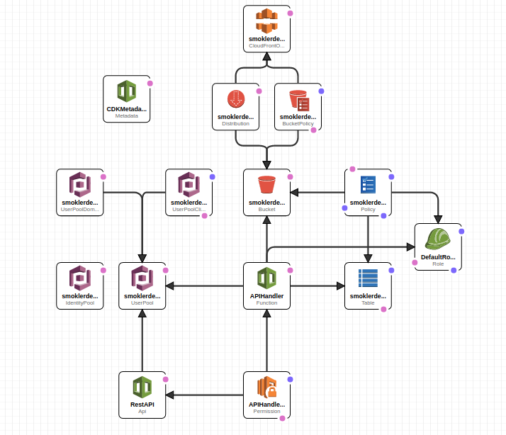

Chalice AWS REST API
========================
Project backed by CloudFormationApi Gateway, Lambda, DynamoDB, IAM, UserPools, S3 and CloudFront

This application is deployed using the AWS CDK.

For more information, see the `Deploying with the AWS CDK
<https://aws.github.io/chalice/tutorials/cdk.html>`__ tutorial.

Quickstart
----------

First, you'll need to install the AWS CDK and Pipenv if you haven't already.
The CDK requires Node.js and npm to run.
See the `Getting started with the AWS CDK
<https://docs.aws.amazon.com/cdk/latest/guide/getting_started.html>`__ for
more details.

::

  $ npm install -g aws-cdk
  $ sudo apt install software-properties-common python-software-properties
  $ sudo add-apt-repository ppa:pypa/ppa
  $ sudo apt update
  $ sudo apt install pipenv

Next you'll need to install the requirements for the project.

Activate environment
::

  $ pipenv shell

Install requirements
::

  $ pipenv install

To deploy the application, ``cd`` to the ``infrastructure`` directory.
If this is you're first time using the CDK you'll need to bootstrap
your environment.

::

  $ cdk bootstrap

Then you can deploy your application using the CDK.
Don't forget activate python environment.

::

  $ cdk deploy

To clean the project from AWS and local installations
::

  $ cdk destroy
  $ pipenv --rm

Project layout
--------------

This project combines a CDK application and a Chalice application.
These correspond to the ``infrastructure`` and ``runtime`` directory
respectively.  To run any CDK CLI commands, ensure you're in the
``infrastructure`` directory, and to run any Chalice CLI commands ensure
you're in the ``runtime`` directory.
